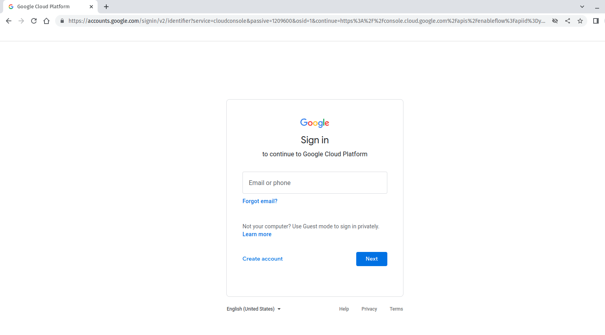
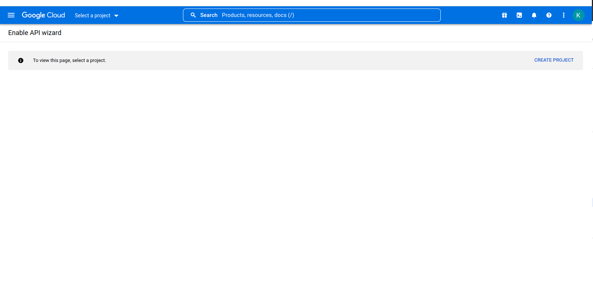
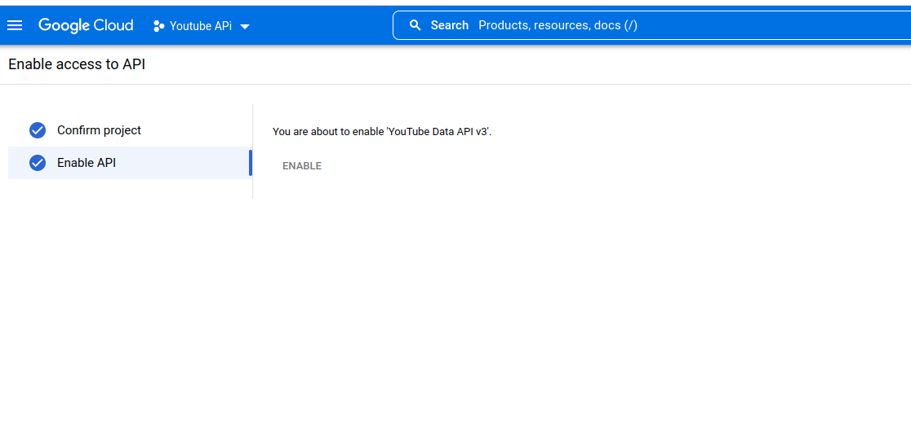
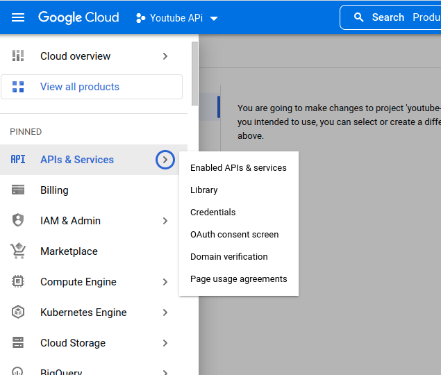
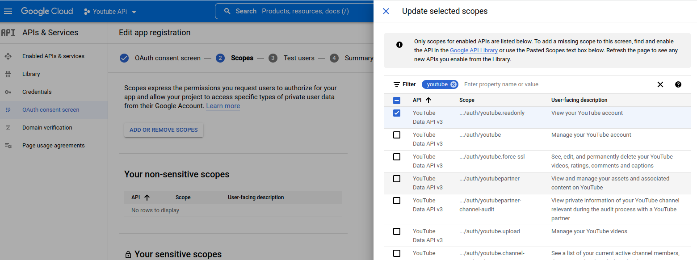
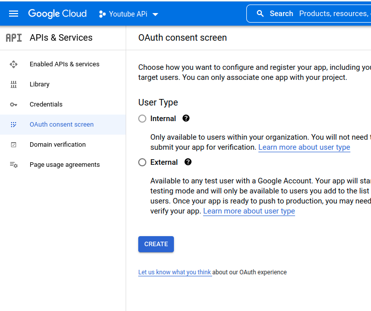
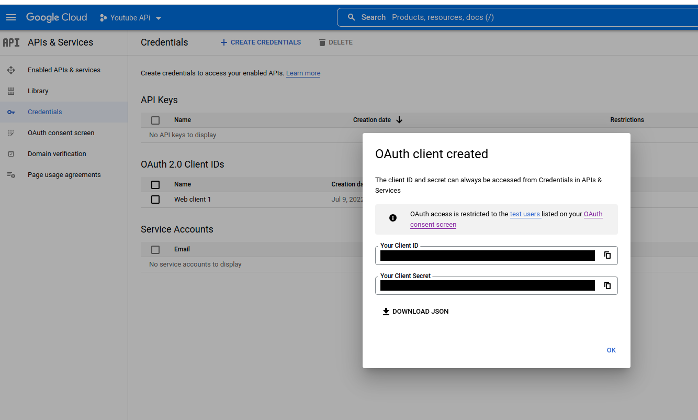

# 
    
## Quick Start
Steps in tracksLiked:
* `git clone https://github.com/Kos-M/tracksLiked`
* `cd  tracksLiked ; npm i`
* `cp env.sample .env`
* Change .env default download location , to match your needs.

Steps in Google : 
You need to create your own app in google Cloud console.

* Start from this wizard:  https://console.developers.google.com/start/api?id=youtube
* Login page
* Create Porject -> Choose name , and(or organization) -> Next -> Enable api
* Go to Credentials Page -> CREATE CREDENTIALS -> Oauth client ID -> configure consent screen
* Fill App information -> choose your email also in dev email enter yours.
* Add Or Remove Scopes -> select only ( YouTube Data API v3	.../auth/youtube.readonly	View your YouTube account ) -> Update 
Here you can add more test users/emails  if you wish
* Save and continue

After setup of  OAuth consent screen
Now we can create actual credentials
* click on Credentials tab above OAuth consent screen.
* CREATE CREDENTIALS -> Oauth client ID -> Web Application -> Create
* In Next Pop up click download json in project root dir as `client_secret.json`
* Done > Run by  ` node index.js` or `npm start`

<a href="https://github.com/Kos-M/tracksLiked/blob/a7362bd545790fcf99547f669f3bab65df0add29/img/step1.png" target="_blank" >
    

        
    

    

        Login page
    

</a>

<a href="https://github.com/Kos-M/tracksLiked/blob/a7362bd545790fcf99547f669f3bab65df0add29/img/create_project.png" target="_blank" >
    

        
    

    

        Create Porject
    

</a>

 <a href="https://github.com/Kos-M/tracksLiked/blob/a7362bd545790fcf99547f669f3bab65df0add29/img/api_enabled.png" target="_blank" >
    

        
    

    

        Api Enabled
    

</a>

 <a href="https://github.com/Kos-M/tracksLiked/blob/a7362bd545790fcf99547f669f3bab65df0add29/img/go_to_credentials.png" target="_blank" >
    

        
    

    

         Go to Credentials Page
    

</a>

 <a href="https://github.com/Kos-M/tracksLiked/blob/a7362bd545790fcf99547f669f3bab65df0add29/img/scope_selected.png" target="_blank" >
    

        
    

    

         Select Scopes
    

</a>

 <a href="https://github.com/Kos-M/tracksLiked/blob/a7362bd545790fcf99547f669f3bab65df0add29/img/create_consent_screen.png" target="_blank" >
    

        
    

    

         Create Consent Screen
    

</a>

 <a href="https://github.com/Kos-M/tracksLiked/blob/a7362bd545790fcf99547f669f3bab65df0add29/img/save_credentials.png" target="_blank" >
    

        
    

    

         Save Credentials as client_secret.json
    

</a>

    

    
